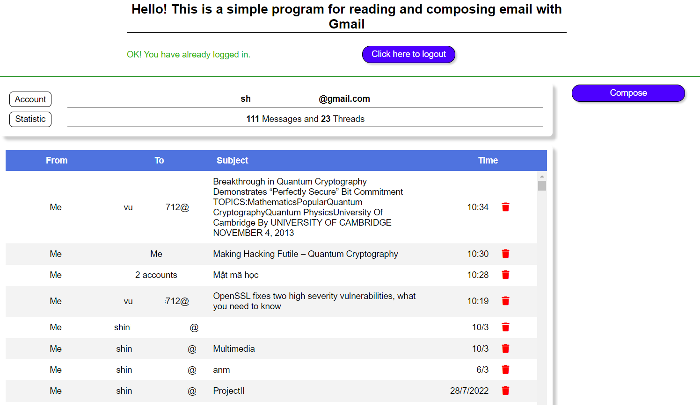
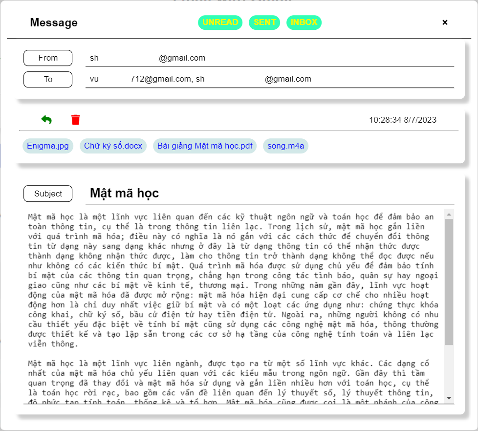
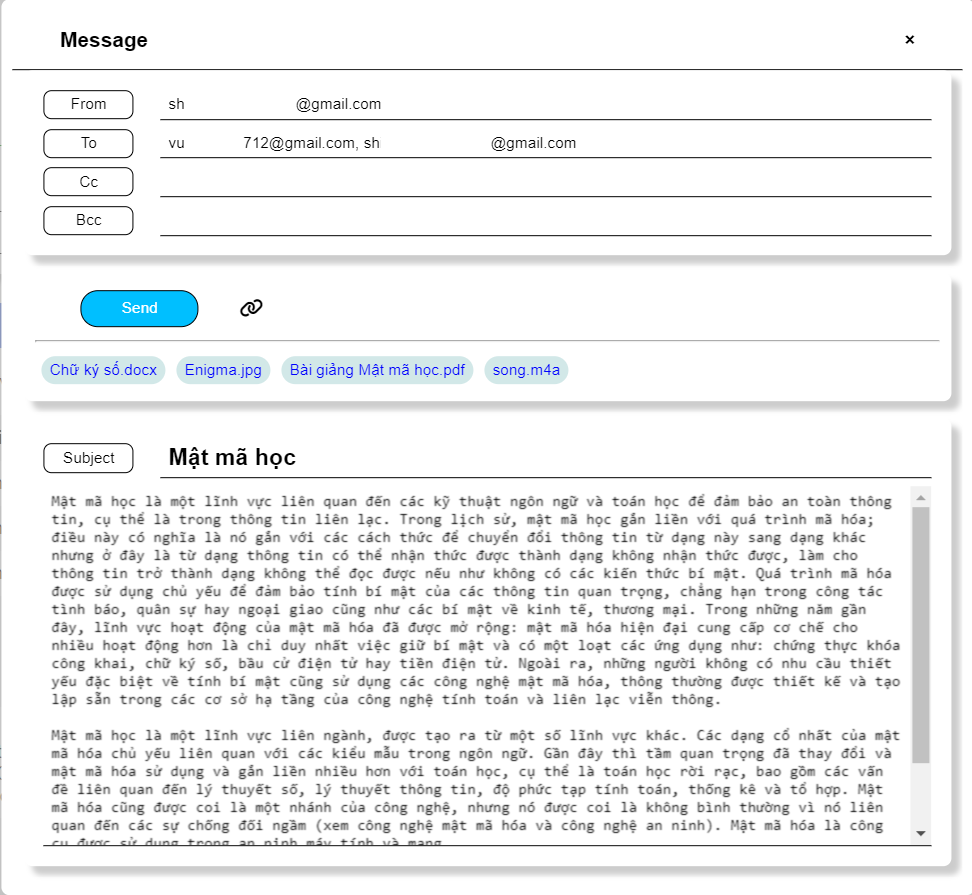

# Local Gmail Manager

This is an simple app for interacting with *Google OAuth Server* and *Gmail API Server*.

## Overview

### Implemented

- Version 1.0
  - Sign in, sign out with Google OAuth
  - Show email list
  - Show email detail
  - Compose and Send email (text, with separate attachments)
  - Trash email
  
### Not Implemented

- Reply
- Filter and Query
- Embedded Email (html with embedded attachments)
- Automatic sending (use data from .xlsx or .csv)
- Send scheduling
- Draft
- Refreshing (load new).

## Details

### UI

- List View

- Detail View

- Compose and Send View

### User Guide

#### Deployment

- This is a local app, means you just need your local machine to run it. Both Client and Server files are stored **only** in this folder, with Javascript and HTML/CSS only.
- But to interacting with Google OAuth Server, you need to run this app as a Server (at address localhost).
- You can run with:
  - **Live Server** extension in Visual Studio Code: Open this folder in VS Code and Run Live Server with `index.html`.
  - **Apache HTTP Server**: Installed [it](https://httpd.apache.org/) on your machine and Copy this folder to **htdocs** folder (located in *Apache Folder*, depends on your install configurations).
  - Any many more...

### Sign in with Google

- My Google Project is just in **Test** phase so you need to be added as Test Users to sign in with Google.
- Or you can create a Google Project for your own. (The step is in [below](#create-google-project-and-enable-gmail-api)). Once finish your Google Project:
  - Fill your API Key in `index.html#api-key`
  - Fill your Client ID in `index.html#client-id`
  - Replace `const REDIRECT_URI` in src/main.js.
  - Replace `const LOCALE` in src/main.js with your locale.

#### Functionality

| Functionality  | Guide  |
|---|---|
| Sign in | Click on Sign in button and Choose account. Check `Remember me` if want.   **NOTE**: Just an account that has been added to **Test users** in the Google Project |
| Load old emails  | Scroll to the end of the list will trigger email-loading  |
| Load new emails  | Not implemented yet. Just reload the page |
| Show email  | Click on row |
| Trash email  | Click on Trash icon (both in list and detail view) or `Ctrl` + Click on row (in list).   **NOTE**: Trash email will not prompt for confirming. Untrash is not implemented yet |
| Download attachment | Click on it (both in reading/composing) |
| Remove added attachment | `Ctrl` + Click on it (in composing only) |

## Create Google Project and Enable Gmail API

[Develop on Google Workspace Guide](https://developers.google.com/workspace/guides/get-started)

- Use your personal Google account to sign in with [Google Cloud](https://console.cloud.google.com/)
- Select a created Project or Create New one.
- Find **APIs & Services** item on **Navigation Menu** and Choose tab **Library**.
- Search and Choose Gmail API in API Library screen, then *Enable* it.
- Move to tab **Credentials** and click on **Create Credentials**. Create one *API Key* (for accessing public resources) and one *OAuth Client ID* (for accessing user resources).
- To create *OAuth Client ID*, you must config **OAuth consent screen** (the screen showed to allow user set permission for the app when he/she sign in with Google).
  - Set User type as **External** (if you are not in a Google Workspace).
  - Set your App name (that will be display in Consent screen).
  - *Scopes* and *Test Users* can be set later.
- To create a **OAuth Client ID**, you should specify:
  - *Application type*: **Web application**.
  - *Name*: Your custom app name (just show for console).
  - *Authorized JS origins*: This identifies the domains from which your application can send API requests to the OAuth 2.0 server. *Because the app run with a Server, so you may not need to set this field*.
  - *Authorized redirected URIs*: The URI that redirect user after he/she signed in with Google. You should add with `htpp://127.0.0.1:<port>/index.html`. The `<port>` must match the port that Local Server (Live Server or Apache HTTP Server) run your app.
    - Copy the value and place in `const REDIRECT_URI` in **src/main.js**.
    - If not match, Google OAuth Server will prompt error *redirect_uri_mismatch* to user.

- Because of the User type specified as **External**, if the app is not verified (as in our case), to using this app, the user must be added as Test Users.
  - Go to **OAuth consent screen** tab and Add Test Users.
  - If signed in account does not match with any account in Test Users, Google OAuth Server will prompt error *access_denied* to user.

## References

- [Google Identity Service - GIS](https://developers.google.com/identity/oauth2/web/reference/js-reference) & [Google API Javascript Client - GAPI](https://github.com/google/google-api-javascript-client/blob/master/README.md): These libraries provide a more secure and less error-prone way for handling authentication/authorization (OAuth flow) and accessing Gmail API Endpoints than how my app is implemented.
- [Javascript Quickstart](https://developers.google.com/gmail/api/quickstart/js): A sample for using these libraries.
- [Gmail REST](https://developers.google.com/gmail/api/reference/rest): No matter how you calling a Gmail API Endpoint, you should know the path to it.
